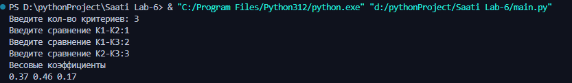
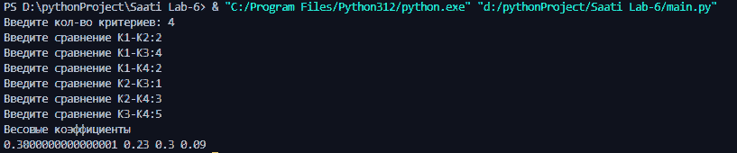

# Lab - 6

# Автор программы
Лада Александр Фт-210007

# Функционал программы
Данная программа основана на Методе Анализа Иерархий (МАИ) Саати, на основе входных данных выводит весовые коэффициенты для каждого критерия

# Запуск программы
ППрограмма была написана в Visual Studio Code на языке Python, но открыть её можно в абсолютно любой среде программирования. Чтобы воспользоваться программой, вам надо открыть файл с названием “Лаб. работа №6”, при необходимости скачать библиотеку "numpy", нажать Enter и следовать инструкции.

# Тесты
Тест 1

________
Тест 2

